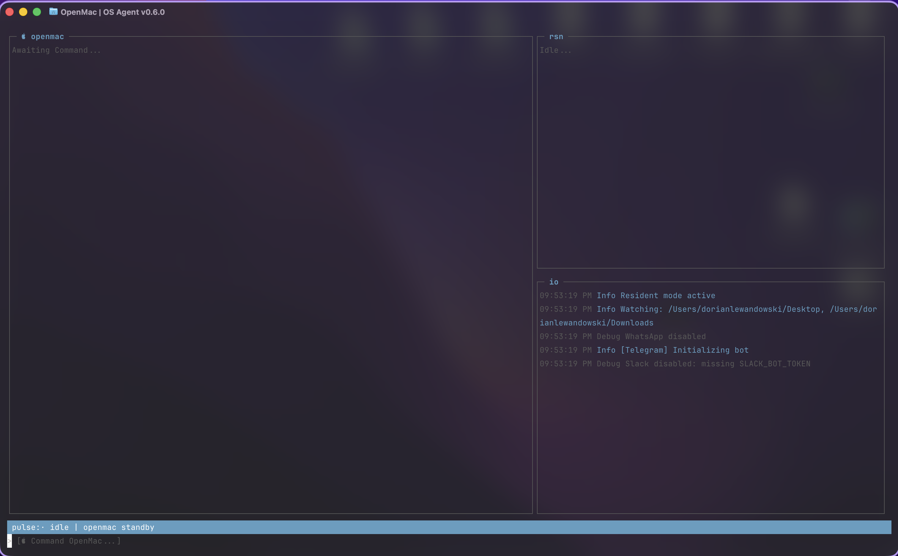

#  OpenMac | Autonomous OS Agent for Power Users

OpenMac is a local-first autonomous macOS agent designed for operators who want a persistent, high-signal command layer over their workstation. It combines local reasoning, a dense mission-control TUI, Telegram-based remote control, durable memory, and macOS automation into a single system built for serious personal workflows.



Save the TUI screenshot at `assets/tui-preview.png` to render the preview above.

## Core Pillars

- 🧠 **Local Model Runtime**: Ollama-backed chat, embedding, and vision providers.
- 📟 **High-Density TUI**: A mission-control interface built with `neo-blessed`.
- 📱 **Telegram Command Center**: Remote screenshotting, status checks, pairing, and file analysis.
- 💾 **Layered Memory**: SQLite facts, LanceDB vector memory, and in-memory session/source context.
- 🔐 **Remote Safety**: Pairing, approval expiry, audit logs, and remote-safe tool policy.

## Architecture

OpenMac is structured as a resident agent rather than a single-turn assistant.

- A resident orchestrator manages tasks from the terminal, file watchers, schedulers, and gateways.
- Specialized sub-agents split work across research, coding, and system operations.
- Keyed queues isolate work by source and session.
- Session state tracks recent conversation per source and per source ID.
- LanceDB stores semantic memory for contextual recall across files, chats, and learned experiences.
- Telegram acts as a secure remote surface for commands, screenshots, approvals, and image-triggered analysis.
- The TUI presents chat, reasoning, queue state, and system I/O in real time.

## Getting Started

1. Clone the repository.

```bash
git clone <your-repo-url>
cd mac-ai-assistant
```

2. Install dependencies.

```bash
npm install
```

3. Create your local environment file.

```bash
cp .env.example .env
```

4. Optionally copy `openmac.json.example` to `openmac.json` and move stable config there.

```bash
cp openmac.json.example openmac.json
```

5. Fill in the required values inside `.env` and/or `openmac.json`.

6. Run onboarding if you want the repo to create local config files for you.

```bash
npm run onboard
```

7. Run a startup health check.

```bash
npm run doctor
```

8. Link the global command.

```bash
npm link
```

9. Run OpenMac from anywhere.

```bash
openmac
```

10. Optional: install a `launchd` agent for resident startup.

```bash
npm run launchd:install
```

## Required Environment

At minimum, configure the following:

```env
TELEGRAM_ENABLED=
TELEGRAM_BOT_TOKEN=
TELEGRAM_CHAT_ID=
OLLAMA_MODEL=
```

Recommended config split:

- `.env` for secrets and tokens
- `openmac.json` for non-secret runtime behavior like watcher directories, schedules, and security policy

Useful commands:

```bash
npm run doctor
npm run onboard
npm run launchd:install
npm run update:help
npm run release:pack
npm run typecheck
npm run test
npm run build
```

Release packaging:

```bash
npm run release:pack
```

This creates:

- `releases/openmac-<version>/`
- `releases/openmac-<version>.tar.gz`

The release bundle includes compiled `dist/`, a production `bin/openmac` launcher, `README.md`, example config files, and `package-lock.json` for deterministic installs.

Additional optional keys are included in `.env.example` and `openmac.json.example`.

## Telegram Command Center

OpenMac uses an owner-based Telegram model:

- `TELEGRAM_CHAT_ID` is the owner account used for approvals
- New Telegram users pair using a generated code
- The owner approves pairing with `/approve <code>` or denies it with `/deny <code>`
- Dangerous remote actions can be blocked by remote-safe policy before approval

- `/start` boots the remote session.
- `/status` reports system state.
- `/screen` captures the current desktop.
- `/approve <code>` approves a pending pairing request.
- `/deny <code>` denies a pending pairing request.
- Sending plain text creates a task.
- Sending a photo triggers image analysis through the agent pipeline.

## Slack And WhatsApp Pairing

Slack and WhatsApp now support local pairing/allowlist approval.

- Slack inbound requires both `SLACK_BOT_TOKEN` and `SLACK_APP_TOKEN`
- Trusted Slack DMs can also be pre-allowlisted with `OPENMAC_SLACK_ALLOW_FROM`
- Trusted WhatsApp chats can be pre-allowlisted with `OPENMAC_WHATSAPP_ALLOW_FROM`
- WhatsApp groups are controlled separately with:
  - `OPENMAC_WHATSAPP_GROUP_POLICY`
  - `OPENMAC_WHATSAPP_GROUP_ALLOW_FROM`

Pairing commands:

- `openmac pairing list slack`
- `openmac pairing approve slack <CODE>`
- `openmac pairing list whatsapp`
- `openmac pairing approve whatsapp <CODE>`

## Security

Your `.env` file contains tokens, identifiers, and runtime configuration. Keep it private.

- `.env` is ignored by git.
- Never commit production tokens.
- `TELEGRAM_CHAT_ID` should point to the owner Telegram account.
- Review `OPENMAC_REMOTE_SAFE_MODE` and `OPENMAC_REMOTE_ALLOWED_PERMISSIONS` before enabling remote control broadly.
- Security audit events are written to `data/security-audit.jsonl`.
- Telegram pairings are stored in `data/telegram-pairings.json`.
- Treat screenshots and local memory data as sensitive operator context.

## Developer Notes

- Runtime entrypoint: `src/core/openmacApp.ts`
- CLI entrypoint: `src/cli.ts`
- Local model runtime: Ollama via provider abstraction in `src/models/`
- Default orchestration model: Gemma 4
- Vector memory: LanceDB
- Terminal interface: `neo-blessed`
- Persistent memory: SQLite + semantic retrieval
- Session memory: in-memory session/source history
- Queue model: keyed queue isolation by source and source ID

## Operational Philosophy

OpenMac is built in the style of a local operator console: low-latency, high-visibility, and deeply integrated with the host machine. The goal is not chat for chat’s sake. The goal is an intelligent control surface for macOS that remembers, observes, reasons, and acts.
